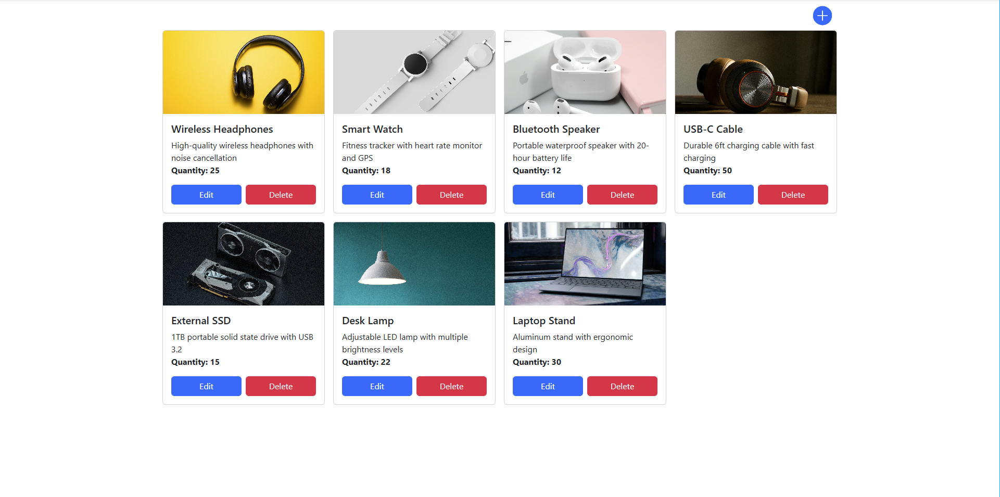

# Products Database Setup Guide

This guide explains how to set up the `products` database using the provided SQL dump file.

## Prerequisites

- MySQL Server 8.0 or higher
- MySQL Workbench (optional, for GUI method)
- Command line terminal

## Quick Start

```bash
# Clone repository (if applicable)
git clone https://github.com/yourusername/https://github.com/Ucis-cmd/product-storage-app.git
cd product-storage-app

# Import database (using command line)
mysql -u root -p products < products_dump.sql
```
```bash
cd api
npm start
```
```bash
cd client
npm run dev
```



